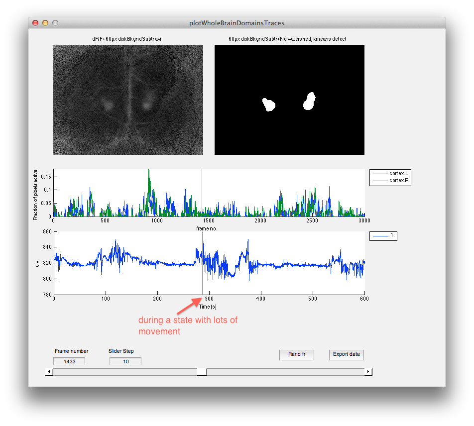
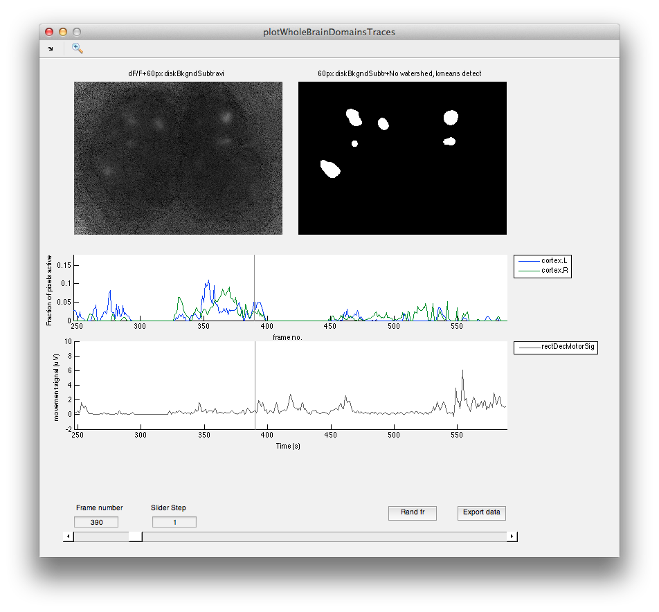

Author: James B. Ackman  
Date: 2013-07-03 12:16:50  

# wholeBrainDX

Image analysis software for whole brain calcium imaging movies (Ackman et al. 2012-2013; *unpublished*).

# Installation
TODO:

# Dependencies
TODO:

# Examples

## Instructions

See [wholeBrain_workflow.md](wholeBrain_workflow.md)

## plotWholeBrainDomainsTraces GUI
This is from 2013-04-01_analysis.txt on 2013-04-18 08:55:30. Shows how to use the plotWholeBrainsDomainsTraces GUI.

	plotWholeBrainDomainsTraces(movie1,movie3,region.locationData.data,[],movieTitles,[])

## Plot the rectified decimated motor signal in gui

This is from 2013-04-01_analysis.txt  on 2013-04-30 14:17:29.   
Setup up plot 4 data structure that can be passed to plotWholeBrainDomainsTraces.m instead of the sigtoolfigurehandle.  I edited the defaults for varargin{4} in plotWholeBrainDomainsTraces.m to flexibly take in a premade plot4 structure (below) so the rectified, decimated motor signal that I used for the correlations above can be plotted and compared within the gui environment. I made the 'unitConvFactor' variable to handle this more flexibly than the Fs variable I had before so that it will work with these similar sampling rate signals or with differing sampling rate signals. 

	plot4(1).data=decY2;
	plot4(1).legendText = ['rectDecMotorSig'];
	plot4(1).Fs=1;   %sampling rate (Hz).  Used to convert data point indices to appropriate time units.  Leave at '1' for no conversion (like plotting the indices, 'frames')
	plot4(1).unitConvFactor = 1;  
	
	plotWholeBrainDomainsTraces(movie1,movie3,region,plot4,[],movieTitles)

## Moving Average of Calcium and Motor Activity Signals ##
Used as inputs to fetching iterative correlation coefs between these signals at different lags. 
This is from 2013-04-01_analysis.txt on 2013–05–02 09:15:14 at [[Plot moving average of raw time courses]]. Shows motor signal detection and how to Perform [[Iterative correlation with different lags]]

Demonstrates positive correlation between brain activity and motor signal at short time lags (seconds) and anti-correlation at long time lags (10s of seconds to minutes).

